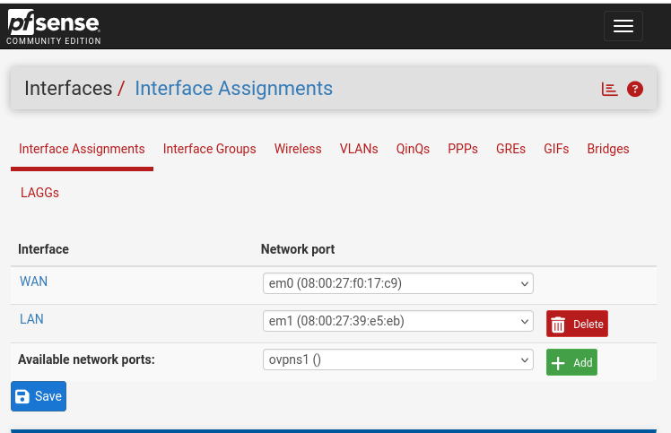
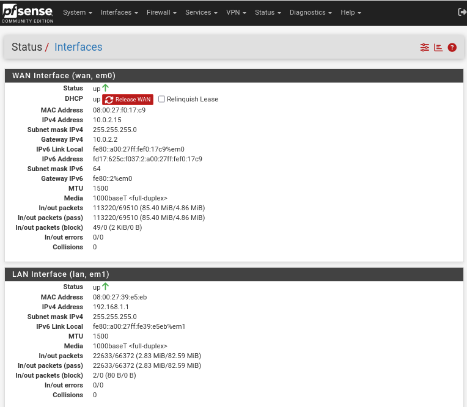
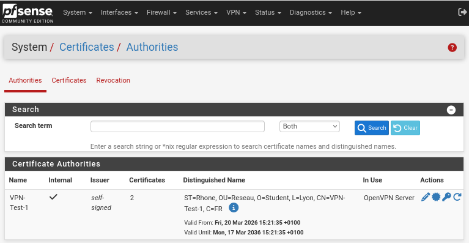
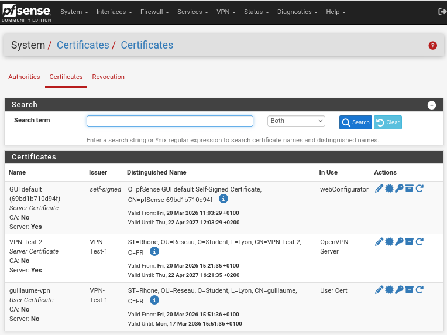
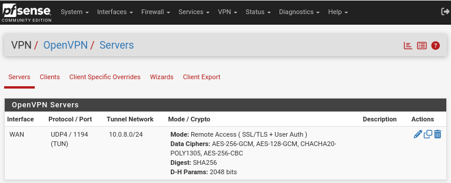
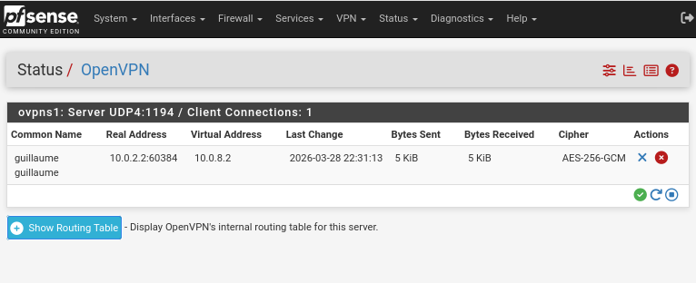
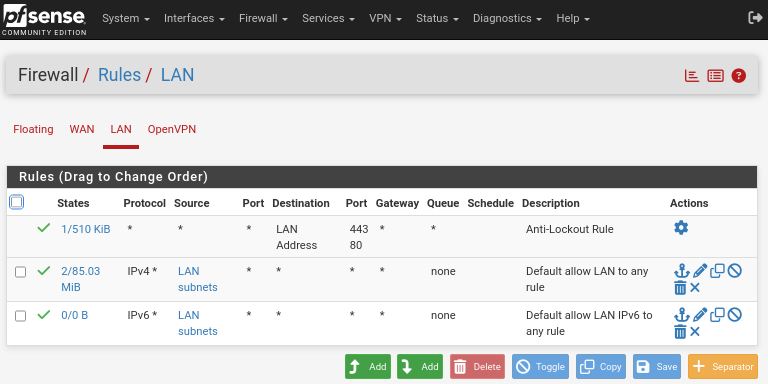
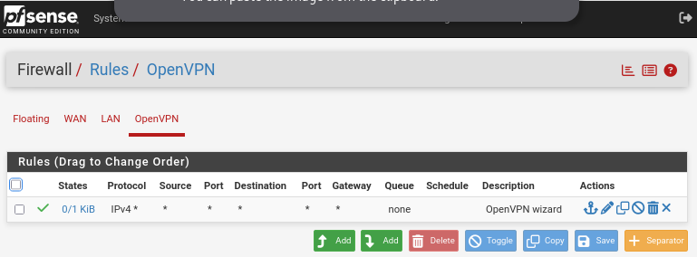
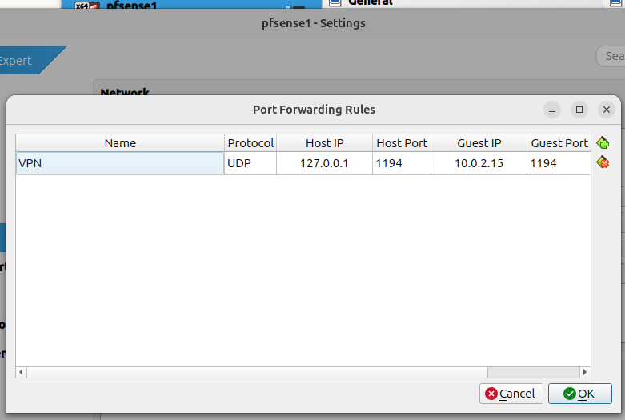
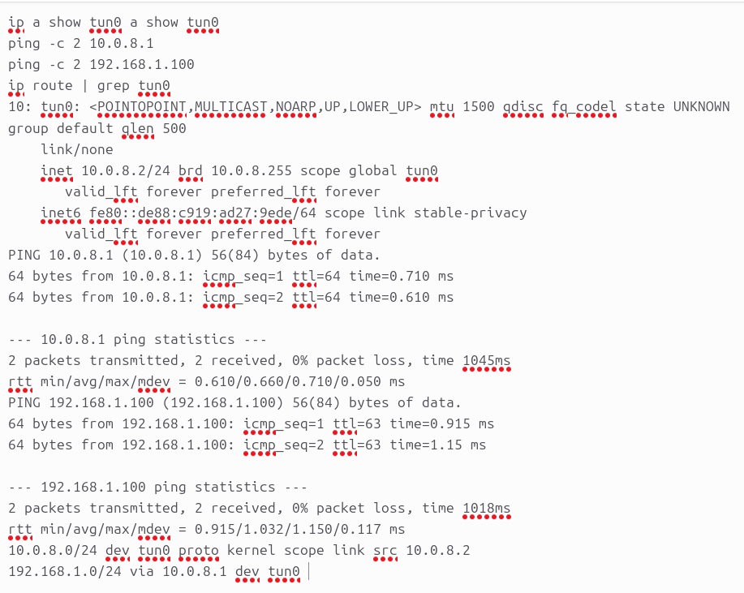

# 🔒 Lab pfSense + OpenVPN

> Lab personnel de pare-feu et VPN réalisé en un week-end — simulation d'une infrastructure réseau sécurisée avec accès distant via tunnel VPN.

## 🎯 Objectifs du projet

Mettre en place une infrastructure réseau complète en environnement virtualisé pour :

1. **Déployer un pare-feu pfSense** comme routeur/firewall central
2. **Monter un serveur OpenVPN** avec authentification par certificats (PKI) et identifiants
3. **Accéder à une machine distante** (VM Debian) de manière sécurisée via le tunnel VPN
4. **Router le trafic internet** de la VM à travers le pare-feu

## 🏗️ Architecture réseau

```
┌─────────────────────────────────────────────────────────────────┐
│                        MACHINE HÔTE                             │
│                    Ubuntu (PC fixe)                              │
│                   Client OpenVPN                                │
│                  IP tunnel : 10.0.8.2                            │
│                                                                 │
│   ┌─────────────────────────────────────────────────────────┐   │
│   │                    VirtualBox                            │   │
│   │                                                         │   │
│   │   ┌───────────────────┐     ┌───────────────────────┐   │   │
│   │   │     pfSense       │     │     Debian 13         │   │   │
│   │   │    v2.8.1         │     │    (Client LAN)       │   │   │
│   │   │                   │     │                       │   │   │
│   │   │  WAN: 10.0.2.15   │     │  IP : 192.168.1.100  │   │   │
│   │   │  (NAT VirtualBox) │     │  GW : 192.168.1.1    │   │   │
│   │   │                   │     │                       │   │   │
│   │   │  LAN: 192.168.1.1 ├─────┤  (réseau interne)    │   │   │
│   │   │                   │     │                       │   │   │
│   │   │  VPN: 10.0.8.1    │     │                       │   │   │
│   │   │  (tunnel OpenVPN) │     │                       │   │   │
│   │   └───────┬───────────┘     └───────────────────────┘   │   │
│   │           │                                             │   │
│   └───────────┼─────────────────────────────────────────────┘   │
│               │ Port Forwarding                                 │
│               │ UDP 1194 (hôte) → UDP 1194 (pfSense WAN)       │
└───────────────┼─────────────────────────────────────────────────┘
                │
           ┌────┴────┐
           │  Box    │
           │ Internet│
           └────┬────┘
                │
            Internet
```

## 📋 Stack technique

| Composant | Détail |
|-----------|--------|
| Hyperviseur | VirtualBox |
| Pare-feu / Routeur | pfSense 2.8.1 (FreeBSD 15.0) |
| VPN | OpenVPN (UDP 1194, mode TUN) |
| Chiffrement | AES-256-GCM, fallback AES-256-CBC |
| Authentification | Double auth : PKI (certificats x509) + identifiants (SSL/TLS + User Auth) |
| Hash HMAC | SHA-256 |
| Diffie-Hellman | 2048 bits |
| Système client | Debian 13 |
| Machine hôte | Ubuntu (AMD Ryzen 7 5825U) |

## 🔧 Étapes clés de configuration

### 1. Mise en place de pfSense

Installation de pfSense 2.8.1 sur VirtualBox avec deux interfaces réseau :
- **WAN** (`em0`) en NAT — accès internet via VirtualBox
- **LAN** (`em1`) en réseau interne — réseau `192.168.1.0/24`


*Dashboard pfSense — version 2.8.1-RELEASE, système opérationnel*


*Assignation des interfaces : WAN (em0), LAN (em1), et interface OpenVPN disponible*


*Status des interfaces — WAN (10.0.2.15) et LAN (192.168.1.1) actifs*

### 2. Infrastructure à clés publiques (PKI)

Mise en place d'une PKI complète sur pfSense :
- Création d'une **autorité de certification (CA)** auto-signée « VPN-Test-1 » (O=Student, OU=Reseau, L=Lyon)
- Génération du **certificat serveur** « VPN-Test-2 » signé par la CA
- Génération du **certificat client** « guillaume-vpn » pour l'authentification VPN
- Vérification du nom x509 côté client (`verify-x509-name "VPN-Test-2"`)


*CA auto-signée « VPN-Test-1 » — valide 10 ans, utilisée par le serveur OpenVPN*


*Chaîne de certificats complète : certificat serveur (VPN-Test-2) + certificat client (guillaume-vpn)*

### 3. Serveur OpenVPN

Configuration du serveur OpenVPN sur pfSense :
- Mode : **Remote Access (SSL/TLS + User Auth)** — double authentification
- Protocole : UDP4, port 1194, mode tunnel (TUN)
- Réseau tunnel : `10.0.8.0/24`
- Chiffrement : AES-256-GCM (prioritaire), AES-128-GCM, CHACHA20-POLY1305, AES-256-CBC (fallback)
- Diffie-Hellman : 2048 bits
- Push de la route `192.168.1.0/24` vers les clients VPN


*Serveur OpenVPN — SSL/TLS + User Auth, AES-256-GCM, tunnel 10.0.8.0/24*


*Client « guillaume » connecté — IP tunnel 10.0.8.2, chiffrement AES-256-GCM actif*

### 4. Règles de pare-feu

Configuration des règles de filtrage sur les interfaces LAN et OpenVPN :


*Règles LAN : anti-lockout rule + autorisation du trafic LAN sortant (IPv4/IPv6)*


*Règles OpenVPN : autorisation du trafic des clients VPN vers le réseau local*

> **Note** : en environnement de production, les règles « pass all » seraient remplacées par des règles restrictives ciblant uniquement les ports et protocoles nécessaires (principe du moindre privilège).

### 5. Connectivité client (port forwarding)

Pour permettre au PC hôte de se connecter au VPN, une règle de port forwarding NAT a été configurée dans VirtualBox :


*Redirection UDP 127.0.0.1:1194 (hôte) → 10.0.2.15:1194 (WAN pfSense)*

Le client OpenVPN sur l'hôte se connecte à `127.0.0.1:1194`, VirtualBox redirige vers le WAN de pfSense.

### 6. VM Debian (machine protégée)

- Debian 13 sur le réseau interne de pfSense
- IP : `192.168.1.100` — passerelle : `192.168.1.1` (pfSense LAN)
- Accès internet opérationnel via pfSense → NAT VirtualBox → box internet

## ✅ Tests de validation

Tous les tests réalisés depuis le PC hôte avec le VPN connecté :

| Test | Commande | Résultat |
|------|----------|----------|
| Tunnel VPN actif | `ip a show tun0` | Interface UP, IP `10.0.8.2/24` |
| Ping pfSense via tunnel | `ping -c 2 10.0.8.1` | 0% perte, ~0.7ms |
| Ping Debian via VPN | `ping -c 2 192.168.1.100` | 0% perte, TTL=63 (traverse pfSense) |
| Routes VPN | `ip route \| grep tun0` | Route `192.168.1.0/24 via 10.0.8.1` poussée |
| Traceroute Debian → internet | `traceroute -n 8.8.8.8` | Hop 1: pfSense → Hop 2: NAT VBox → internet |
| IP publique Debian | `wget -qO- ifconfig.me` | Même IP publique que l'hôte |
| Gateway Debian | `ip route show default` | `192.168.1.1` via pfSense |


*Tests de connectivité — tunnel actif, pings OK (TTL=63 = passage par pfSense), routes VPN poussées*

> **Note sur le TTL** : le ping vers la Debian renvoie TTL=63 (au lieu de 64). Cela prouve que le paquet traverse un routeur (pfSense) via le tunnel — c'est la validation que le trafic emprunte bien le chemin VPN → pfSense → LAN.

## 🚧 Difficultés rencontrées et solutions

### Port forwarding VirtualBox
**Problème** : la connexion VPN échouait initialement — le client ne parvenait pas à joindre pfSense.
**Diagnostic** : le port forwarding NAT de VirtualBox n'était pas configuré, donc le trafic UDP 1194 envoyé à `127.0.0.1` n'était pas redirigé vers le WAN de pfSense.
**Solution** : ajout d'une règle de redirection de port dans VirtualBox (Paramètres > Réseau > Avancé > Redirection de ports) : `UDP 1194 hôte → UDP 1194 VM`.

### Problèmes de routage
**Problème** : le ping depuis le PC hôte vers la VM Debian (`192.168.1.100`) ne passait pas malgré la connexion VPN établie.
**Diagnostic** : pfSense ne poussait pas la route du réseau LAN vers le client VPN, et/ou les règles de pare-feu sur l'interface OpenVPN bloquaient le trafic.
**Solution** : ajout du `push route 192.168.1.0/24` dans la config serveur OpenVPN + autorisation du trafic sur l'interface OpenVPN dans les règles pfSense.

## 📚 Ce que j'ai appris

- **Comprendre la PKI** : comment une autorité de certification signe des certificats serveur et client pour établir une chaîne de confiance
- **Lire un traceroute** : identifier chaque saut réseau et comprendre par où transite le trafic
- **Débugger le réseau méthodiquement** : partir du tunnel (ping gateway VPN), puis le LAN distant, puis internet — couche par couche
- **Différencier NAT et routage** : le NAT masque les adresses (VirtualBox, box internet), le routage les transmet
- **Sécuriser un accès distant** : double authentification, chiffrement fort, vérification du certificat serveur

## 🛠️ Compétences démontrées

`pfSense` · `OpenVPN` · `PKI / Certificats x509` · `Pare-feu / Firewall` · `Règles NAT` · `Segmentation réseau` · `Routage` · `Administration Linux (Debian)` · `VirtualBox` · `Sécurité réseau` · `Diagnostic réseau`

## 📌 Évolutions possibles

- [ ] Ajouter un deuxième réseau LAN (DMZ) avec des règles de pare-feu inter-VLAN
- [ ] Tester WireGuard comme alternative à OpenVPN et comparer les performances
- [ ] Mettre en place Suricata (IDS/IPS) sur pfSense
- [ ] Automatiser le déploiement avec des scripts
- [ ] Ajouter un serveur DNS local (Unbound) sur pfSense

---

*Projet réalisé dans le cadre d'une démarche d'apprentissage autonome en préparation d'une alternance en administration réseau / sécurité IT.*
